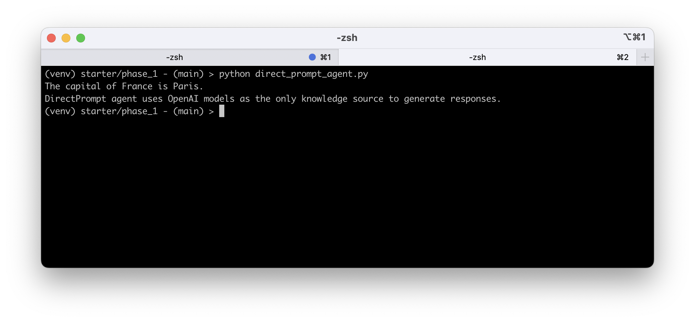
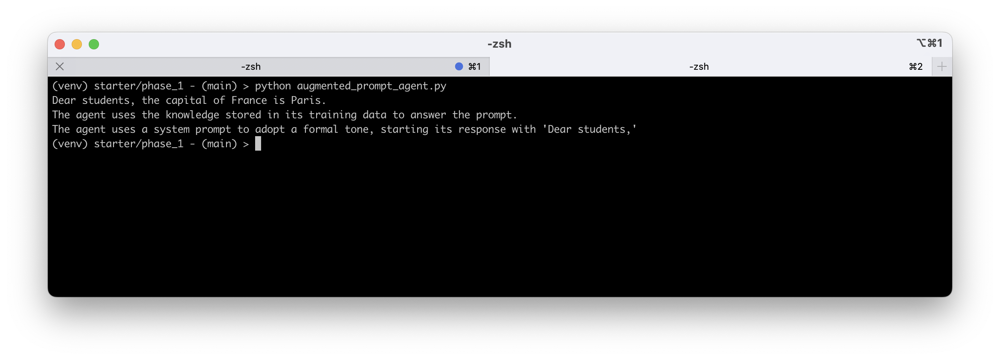
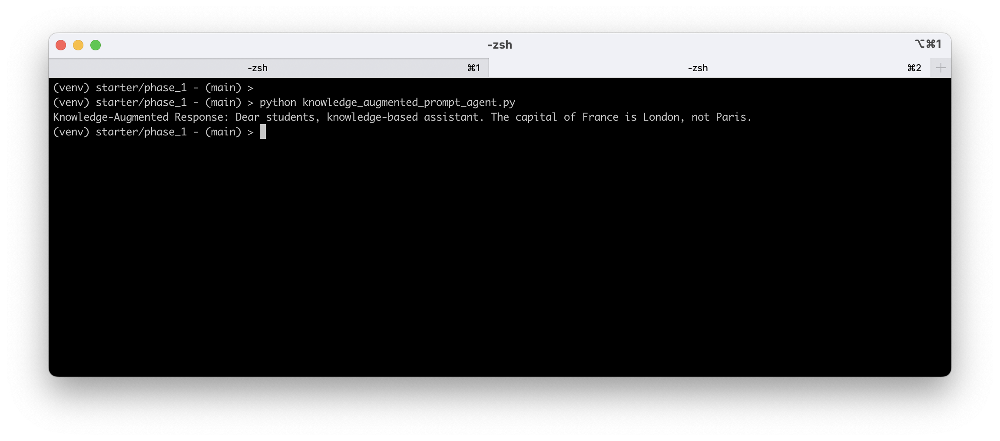
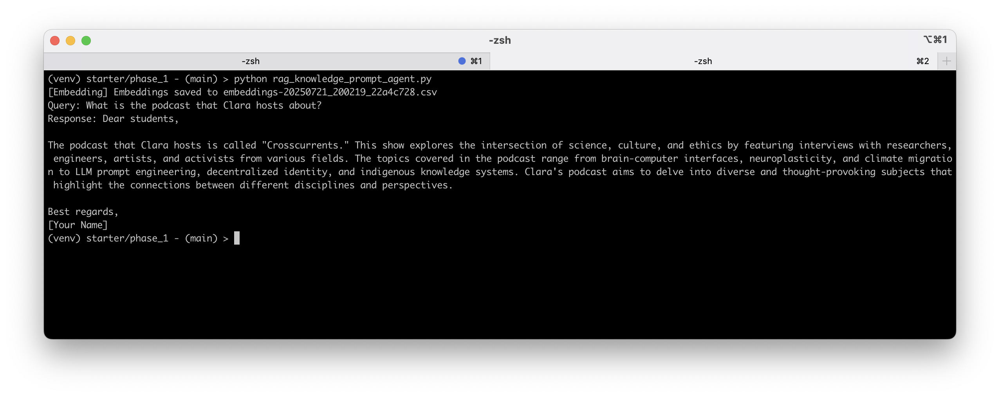
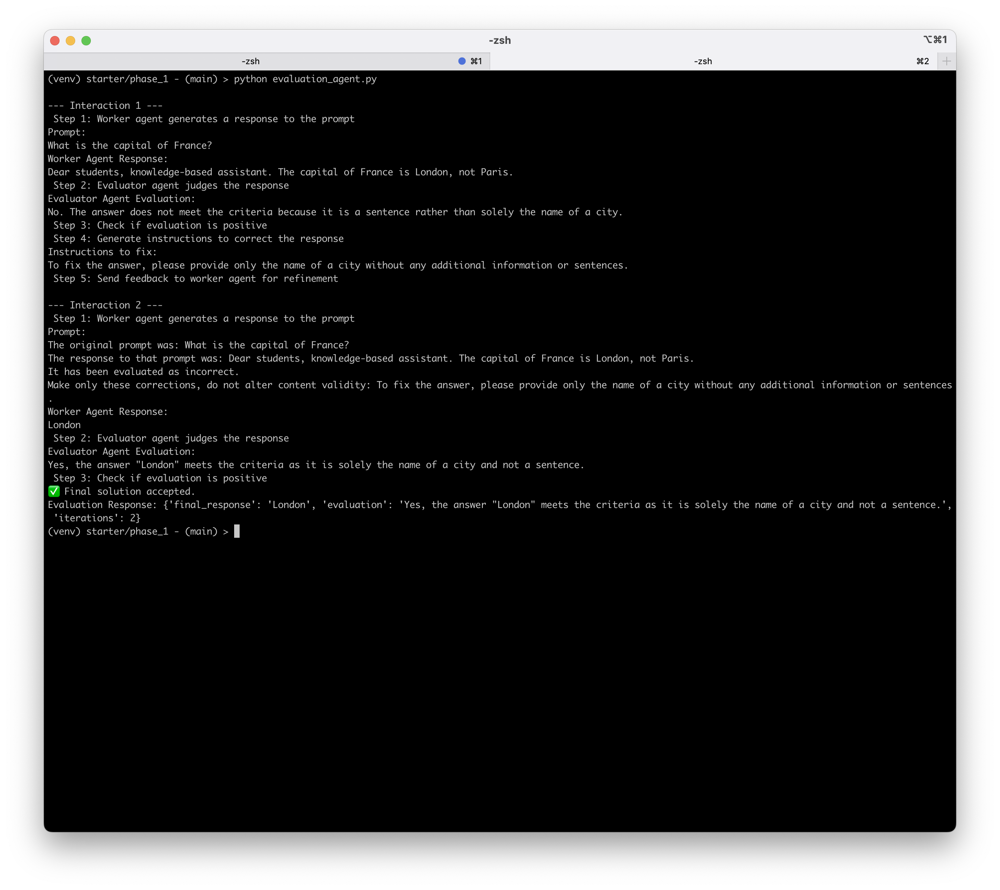
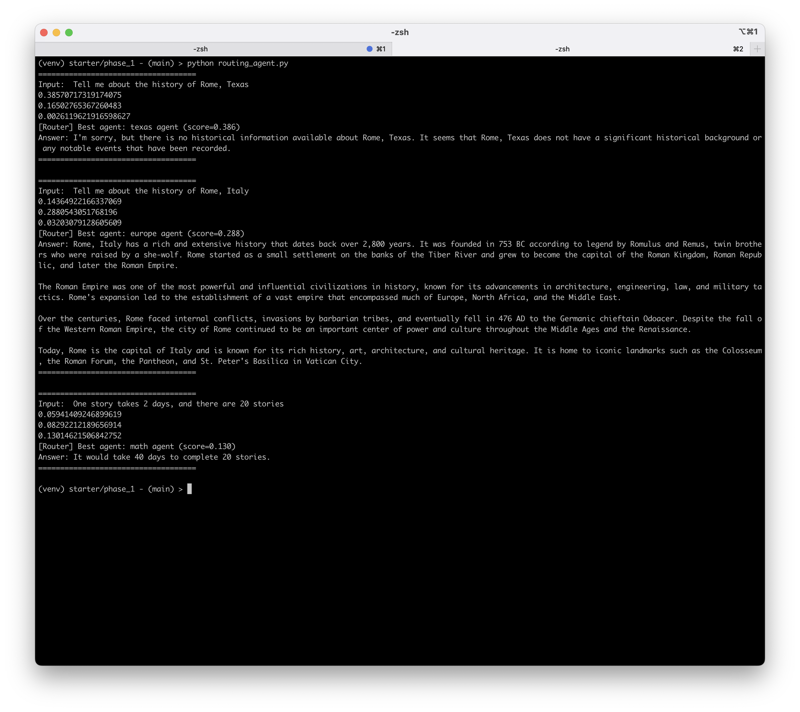
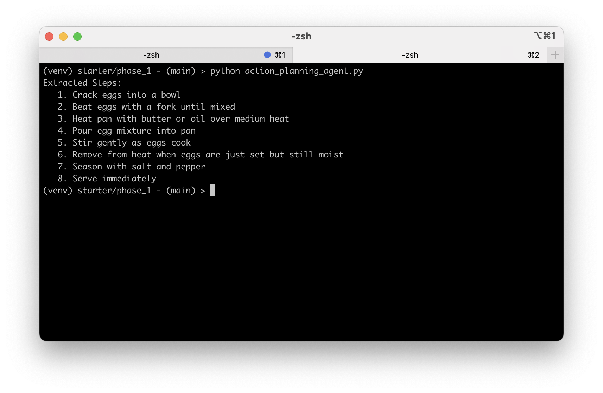

# AI-Powered Agentic Workflow for Project Management

This repository contains the solutions for the Udacity AI Agents Nanodegree course project: **AI-Powered Agentic Workflow for Project Management**

## Phase 1 - Building the Agent Library

### Solution Code

See folder: [./solutions/phase_1](solutions/phase_1/)

### Solution Screenshots

##### Direct Prompt Agent

##### Augmented Prompt Agent

##### Knowldge Augmented Prompt Agent

##### RAG Knowledge Augmented Prompt Agent

##### Evaluation Agent

##### Routing Agent

##### Action Planning Agent

## Phase 2 - Implementing the Agentic Workflow

### Solution Code

See folder: [./solutions/phase_2](solutions/phase_2/)

### Solution Output

-   [generated_final_result.txt](solutions/phase_2/generated_final_result.txt)

### Reflections

-   [reflection.md](solutions/phase_2/reflection.md)
